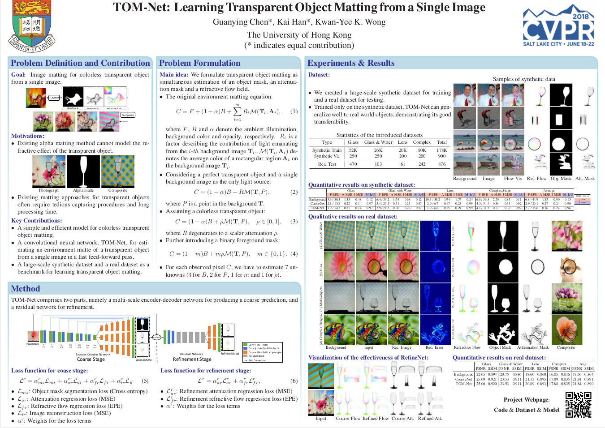

# LaTex Poster for TOM-Net (CVPR 2018)

## Poster Example

      

## Introduction
This code stores the LaTex source code for building the poster for TOM-Net (CVPR 2018). This poster is based on the amazing [LaTex Poster Template](http://www.brian-amberg.de/uni/poster/). You may try to design your own poster based on this example. Please refer to (http://www.brian-amberg.de/uni/poster/) for more examples and FAQ.

- Open `poster_landscape.pdf` to see the built poster.

- Type `Make` to rebuild the poster.

## More LaTex Poster Examples
- [PS-FCN: A Flexible Learning Framework for Photometric Stereo (ECCV 2018)](https://github.com/guanyingc/PS-FCN_Poster_LaTex)
